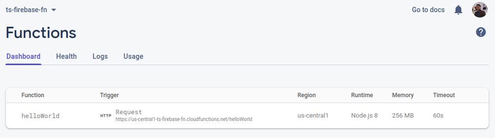

# Firebase Function



```
yarn add --dev firebase-tools

firebase login
firebase projects:list

firebase init

# USE BASH, as nvm are automatically set there
# uses only node engine 8, install via NVM
curl -o- https://raw.githubusercontent.com/nvm-sh/nvm/v0.35.3/install.sh | bash
nvm install 8
nvm use 8

# local testing
firebase emulators:start
firebase emulators:start --only functions

curl https://us-central1-ts-firebase-fn.cloudfunctions.net/addMessage?text=uppercaseme

```

* Firebase init
  * project to use selection
  * will create directories scaffold structure
  * selection js/ts
  * emulator selection
* Admin SDK
  * [x] R/W databases
  * [x] Cloud Messaging messages
  * [x] Access Cloud Storage buckets
  * [x] look up user data
* can have multiple functions from same file
* Triggers are managed at backend, no client interaction required
  * specify a location which would be affected by Triggers
  * Have full admin access, so be careful and keep this in mind while coding
* Firebase extensions - readymade solutions