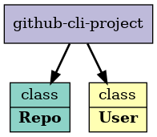

# github-report-cli

* How to setup a new project to use typescript?
  * index.js entrypoint?
* How to facilitate autocomple for npm modules? like lodash
  * install type definitions as dev dependency
    * @types/lodash
  * lodash-ts - seperate typescript implementation
* How do we create a npm package using ts?
* How to feed the apiResponse to a ts class?
  * [ ] Multiple asynchronous responses?
* use Interfaces -> contract
* use class -> inheritance, attributes, methods
* Declare dynamically added class properties in TypeScript

* https://www.npmjs.com/package/@types/lodash
